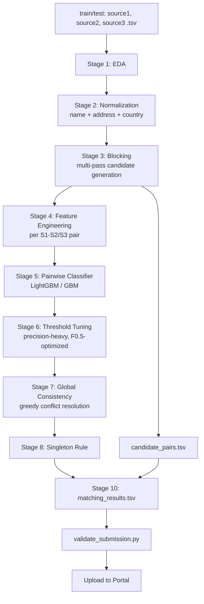

# Business Entity Resolution — Technical PRD & Execution Plan

**Target:** Maximize private-leaderboard F0.5 (macro-averaged per Source-1 entity)
**Constraints:** No external DB/API lookups · Final model MIT/Apache-2.0, ≤8B params · Deadline: tomorrow evening

---

## Table of Contents
1. [Reality Check: What 0.99 Actually Requires](#1-reality-check)
2. [Compliance Guardrails](#2-compliance-guardrails)
3. [System Architecture](#3-system-architecture)
4. [Repository Structure](#4-repository-structure)
5. [Stage 1 — Data Ingestion & EDA](#5-stage-1)
6. [Stage 2 — Normalization](#6-stage-2)
7. [Stage 3 — Blocking / Candidate Generation](#7-stage-3)
8. [Stage 4 — Feature Engineering](#8-stage-4)
9. [Stage 5 — Matching Model](#9-stage-5)
10. [Stage 6 — Threshold Tuning](#10-stage-6)
11. [Stage 7 — Global Consistency Post-Processing](#11-stage-7)
12. [Stage 8 — Singleton Handling](#12-stage-8)
13. [Stage 9 — Local F0.5 Evaluation Harness](#13-stage-9)
14. [Stage 10 — Output Generation & Validation](#14-stage-10)
15. [Model & Tooling Choices (License-Compliant)](#15-model-choices)
16. [24-Hour Execution Timeline](#16-timeline)
17. [Risk Register](#17-risks)
18. [Documentation Template Guidance](#18-docs)
19. [Final Pre-Submission Checklist](#19-checklist)

---

## 1. Reality Check: What 0.99 Actually Requires <a name="1-reality-check"></a>

Be clear-eyed about this before you build, because it changes where you spend your hours.

- F0.5 is computed **per Source-1 entity, then averaged** (macro). A singleton scores exactly 1.0 or exactly 0.0 — there is no partial credit for "almost empty."
- One false merge on a singleton, or one missed match on a multi-match entity, drags the average down by `1/N` where N = total entities. With thousands of test entities, you can absorb *some* errors — but 0.99 means well under 1% of entities can be wrong in aggregate F0.5 terms.
- **Blocking recall is your hard ceiling.** If your candidate-generation stage never surfaces the true match, no matter how good your classifier is, that entity cannot score above 0 (if it had true matches) — this is why Stage 3 gets as much attention as the model itself.
- Datasets built for ML challenges are usually generated by a **bounded noise process** (a fixed set of transformation rules: suffix swaps, transliteration patterns, typo injection, address reordering). If that's true here, a system that reverse-engineers those exact rules from training data can get very close to perfect. If the noise is closer to real-world messiness, 0.99 is unrealistic and 0.90–0.96 would already be an excellent result.
- The leaderboard scorer someone else hit 0.99 on may be scoring the **public subset only** — a smaller, possibly easier slice. Don't calibrate your target off a single number you can't audit; calibrate off your own validation F0.5, computed the same way the organizers compute it (Stage 9 gives you that scorer).

**Bottom line:** build for maximum precision-heavy correctness, treat 0.99 as the stretch ceiling, and use your own held-out F0.5 score — not the leaderboard — as ground truth for whether you're getting there.

---

## 2. Compliance Guardrails <a name="2-compliance-guardrails"></a>

Explicitly **prohibited** (disqualification risk):
- Any live API call to geocode, verify, or enrich a business/address (Google Places, OpenCorporates, government registries, commercial ER services like Dun & Bradstreet, etc.)
- Any lookup against an external business database, even "just to check if a name is valid"
- Scraping or pulling supplementary data from the internet about specific businesses in the dataset

Explicitly **allowed** (the license/parameter clause implies this):
- Pretrained open-source models (embeddings, small LLMs) used purely as *general-purpose language understanding tools* — not as lookups against a business identity database — as long as the **final decision model** is MIT/Apache-2.0 licensed and ≤8B parameters
- Classic string algorithms, statistical NLP, gradient-boosted trees, sentence embeddings

**Gray area to resolve yourself before submitting:** address parsers like `libpostal` are trained on OpenStreetMap data. They don't perform live lookups, but they do encode external knowledge. If in doubt, prefer regex/rule-based address component extraction (built only from patterns you observe in the training data) over pretrained address parsers, or explicitly disclose the tool in your methodology doc and let the organizers judge. Don't guess on this — it's a disqualification risk, and I can't rule on their intent for you.

**License trap to avoid:** Llama models (Meta) and Gemma models (Google) are **not** MIT/Apache-2.0 — they use custom community licenses. Don't use them as your final model even though they're popular and under 8B. Stick to the list in Section 15.

---

## 3. System Architecture <a name="3-system-architecture"></a>



Two outputs fall out of this pipeline naturally:
- `candidate_pairs.tsv` = frozen output of Stage 3 (exactly what Stage 5 scores)
- `matching_results.tsv` = frozen output of Stage 8/9 (final decision)

---

## 4. Repository Structure <a name="4-repository-structure"></a>

```
<team_name>_submission.zip
├── output/
│   ├── matching_results.tsv
│   └── candidate_pairs.tsv
├── code/
│   └── business_entity_resolution/
│       ├── src/
│       │   ├── data_loading.py
│       │   ├── normalization.py
│       │   ├── blocking.py
│       │   ├── features.py
│       │   ├── train_model.py
│       │   ├── infer.py
│       │   ├── postprocess.py
│       │   ├── evaluate.py        # local F0.5 scorer
│       │   └── generate_outputs.py
│       ├── README.md
│       └── requirements.txt
└── Documentation_template.md
```

Sample `requirements.txt`:
```
pandas==2.2.2
numpy==1.26.4
scikit-learn==1.5.1
lightgbm==4.5.0
rapidfuzz==3.9.6
jellyfish==1.0.4
sentence-transformers==3.0.1
faiss-cpu==1.8.0
scipy==1.13.1
tqdm==4.66.4
```

---

## 5. Stage 1 — Data Ingestion & EDA <a name="5-stage-1"></a>

```python
import pandas as pd

s1 = pd.read_csv("dataset/train/train_source1.tsv", sep="\t", dtype=str)
s2 = pd.read_csv("dataset/train/train_source2.tsv", sep="\t", dtype=str)
s3 = pd.read_csv("dataset/train/train_source3.tsv", sep="\t", dtype=str)
gt = pd.read_csv("dataset/train/train_ground_truth.tsv", sep="\t", dtype=str).fillna("")

# Basic shape / null checks
for name, df in [("S1", s1), ("S2", s2), ("S3", s3)]:
    print(name, df.shape, df.isnull().mean().round(3).to_dict())

# Ground-truth distribution — this tells you your class balance
gt["match_list"] = gt["matched_entity_ids"].apply(lambda x: [] if x == "" else x.split(","))
gt["n_matches"] = gt["match_list"].apply(len)
print("Singleton rate:", (gt["n_matches"] == 0).mean())
print("Match count distribution:\n", gt["n_matches"].value_counts().sort_index())

# Country distribution — confirm US/India only in train
print(s1["country"].value_counts())
```

What to look for specifically:
- **Singleton rate** — if it's high (e.g. 30-40%), your precision on "predict nothing" decisions matters as much as your matcher.
- **Match count distribution** — mostly 1:1, or genuinely 1:many? This affects how aggressive your threshold should be.
- **Manually inspect 20-30 true positive pairs** across countries — this is where you reverse-engineer the actual noise patterns (exact suffix swaps used, whether typos are keyboard-adjacent or phonetic, how addresses get reordered). This single hour of manual reading is the highest-leverage EDA you'll do.
- **Do NOT hardcode to {US, India}** anywhere — test has France. Every normalization module needs a generic fallback path.

---

## 6. Stage 2 — Normalization <a name="6-stage-2"></a>

```python
import re, unicodedata

LEGAL_SUFFIXES = {
    "corporation": "corp", "corp": "corp", "incorporated": "inc", "inc": "inc",
    "limited": "ltd", "ltd": "ltd", "private": "pvt", "pvt": "pvt",
    "llc": "llc", "llp": "llp", "gmbh": "gmbh", "sarl": "sarl", "sa": "sa",
    "company": "co", "co": "co",
}

def normalize_name(name: str) -> dict:
    if not isinstance(name, str):
        name = ""
    n = unicodedata.normalize("NFKC", name).lower().strip()
    n = n.replace("&", " and ")
    n = re.sub(r"[^\w\s]", " ", n)
    n = re.sub(r"\s+", " ", n).strip()

    tokens = n.split()
    suffix = None
    core_tokens = []
    for t in tokens:
        if t in LEGAL_SUFFIXES:
            suffix = LEGAL_SUFFIXES[t]
        else:
            core_tokens.append(t)

    return {
        "raw": name,
        "normalized": n,
        "core": " ".join(core_tokens),          # suffix stripped
        "sorted_core": " ".join(sorted(core_tokens)),  # word-order invariant
        "suffix": suffix,
    }

LANDMARK_PATTERN = re.compile(r"\b(near|opp\.?|opposite|behind|next to)\b.*", re.IGNORECASE)
PIN_PATTERNS = {
    "india": re.compile(r"\b\d{6}\b"),
    "us": re.compile(r"\b\d{5}(-\d{4})?\b"),
    "france": re.compile(r"\b\d{5}\b"),
}

def normalize_address(addr: str, country: str = None) -> dict:
    if not isinstance(addr, str):
        addr = ""
    a = unicodedata.normalize("NFKC", addr).lower().strip()
    landmark_match = LANDMARK_PATTERN.search(a)
    landmark = landmark_match.group(0) if landmark_match else None
    a_no_landmark = LANDMARK_PATTERN.sub("", a).strip()

    a_no_landmark = re.sub(r"[^\w\s]", " ", a_no_landmark)
    a_no_landmark = re.sub(r"\s+", " ", a_no_landmark).strip()

    postal = None
    for pat in PIN_PATTERNS.values():
        m = pat.search(a)
        if m:
            postal = m.group(0)
            break

    tokens = a_no_landmark.split()
    return {
        "raw": addr,
        "normalized": a_no_landmark,
        "sorted_tokens": " ".join(sorted(tokens)),
        "postal_code": postal,
        "landmark": landmark,
    }
```

Notes:
- Build `LEGAL_SUFFIXES` out from what you actually see in EDA (Section 5) — the dictionary above is a starting seed, not the final one.
- Keep `raw`, `normalized`, and `sorted_core`/`sorted_tokens` versions — different blocking passes and features use different versions.
- France appears only at test time: this pipeline is country-agnostic by design (no hardcoded country branches), so it degrades gracefully rather than breaking.

---

## 7. Stage 3 — Blocking / Candidate Generation <a name="7-stage-3"></a>

This is the single highest-leverage stage. Run **multiple independent blocking passes** and take the union — recall from the union, precision doesn't matter yet (that's the matcher's job).

```python
import numpy as np
from sklearn.feature_extraction.text import TfidfVectorizer
from sklearn.neighbors import NearestNeighbors
import jellyfish  # phonetic

def phonetic_key(name_core: str) -> str:
    tokens = name_core.split()
    return " ".join(jellyfish.nysiis(t) for t in tokens if t)

def exact_key_blocking(s1_df, other_df):
    """Pass 1: sorted-core-name + first char of postal/country as exact bucket key."""
    pairs = []
    buckets = {}
    for _, row in other_df.iterrows():
        key = (row["sorted_core"], row["country"])
        buckets.setdefault(key, []).append(row["entity_id"])
    for _, row in s1_df.iterrows():
        key = (row["sorted_core"], row["country"])
        for cid in buckets.get(key, []):
            pairs.append((row["entity_id"], cid))
    return pairs

def tfidf_topk_blocking(s1_df, other_df, k=10, char_ngram=(3, 5)):
    """Pass 2: char n-gram TF-IDF cosine similarity, top-k per S1 entity."""
    s1_text = (s1_df["normalized_name"] + " " + s1_df["normalized_addr"]).tolist()
    other_text = (other_df["normalized_name"] + " " + other_df["normalized_addr"]).tolist()

    vec = TfidfVectorizer(analyzer="char_wb", ngram_range=char_ngram, min_df=1)
    all_text = s1_text + other_text
    vec.fit(all_text)
    s1_vecs = vec.transform(s1_text)
    other_vecs = vec.transform(other_text)

    nn = NearestNeighbors(n_neighbors=min(k, len(other_text)), metric="cosine")
    nn.fit(other_vecs)
    dist, idx = nn.kneighbors(s1_vecs)

    pairs = []
    other_ids = other_df["entity_id"].values
    s1_ids = s1_df["entity_id"].values
    for i, neighbors in enumerate(idx):
        for j in neighbors:
            pairs.append((s1_ids[i], other_ids[j]))
    return pairs

def embedding_topk_blocking(s1_df, other_df, model, k=10):
    """Pass 3: semantic embedding ANN (FAISS) — catches transliteration/typo cases TF-IDF misses."""
    import faiss
    s1_text = (s1_df["normalized_name"] + " " + s1_df["normalized_addr"]).tolist()
    other_text = (other_df["normalized_name"] + " " + other_df["normalized_addr"]).tolist()

    s1_emb = model.encode(s1_text, normalize_embeddings=True, show_progress_bar=False)
    other_emb = model.encode(other_text, normalize_embeddings=True, show_progress_bar=False)

    index = faiss.IndexFlatIP(other_emb.shape[1])  # inner product = cosine on normalized vecs
    index.add(other_emb.astype("float32"))
    sims, idx = index.search(s1_emb.astype("float32"), min(k, len(other_text)))

    pairs = []
    other_ids = other_df["entity_id"].values
    s1_ids = s1_df["entity_id"].values
    for i, neighbors in enumerate(idx):
        for j in neighbors:
            pairs.append((s1_ids[i], other_ids[j]))
    return pairs

def union_candidates(*pair_lists):
    seen = set()
    merged = []
    for pairs in pair_lists:
        for p in pairs:
            if p not in seen:
                seen.add(p)
                merged.append(p)
    return merged
```

**Recall measurement (mandatory before moving to Stage 4):**

```python
def measure_blocking_recall(candidate_pairs, ground_truth_df):
    gt_pairs = set()
    for _, row in ground_truth_df.iterrows():
        for m in row["match_list"]:
            gt_pairs.add((row["source1_entity_id"], m))
    cand_set = set(candidate_pairs)
    hit = sum(1 for p in gt_pairs if p in cand_set)
    recall = hit / len(gt_pairs) if gt_pairs else 1.0
    reduction_ratio = 1 - (len(cand_set) / (len(s1) * (len(s2) + len(s3))))
    print(f"Blocking recall: {recall:.4f} | Reduction ratio: {reduction_ratio:.4f}")
    return recall
```

Iterate `k` and the normalization rules **until recall ≥ 0.99 on your validation split** before writing a single line of Stage 4/5 code. Every point of recall lost here is a hard ceiling on your final score that no amount of modeling can recover.

---

## 8. Stage 4 — Feature Engineering <a name="8-stage-4"></a>

```python
from rapidfuzz import fuzz
from rapidfuzz.distance import Levenshtein, JaroWinkler

def pair_features(s1_row, cand_row):
    n1, n2 = s1_row["normalized_name"], cand_row["normalized_name"]
    a1, a2 = s1_row["normalized_addr"], cand_row["normalized_addr"]

    feats = {
        # --- name features ---
        "name_exact": int(n1 == n2),
        "name_core_exact": int(s1_row["core_name"] == cand_row["core_name"]),
        "name_sorted_exact": int(s1_row["sorted_core"] == cand_row["sorted_core"]),
        "name_suffix_match": int(s1_row["suffix"] == cand_row["suffix"]),
        "name_levenshtein_ratio": Levenshtein.normalized_similarity(n1, n2),
        "name_jaro_winkler": JaroWinkler.similarity(n1, n2),
        "name_token_sort_ratio": fuzz.token_sort_ratio(n1, n2) / 100,
        "name_token_set_ratio": fuzz.token_set_ratio(n1, n2) / 100,
        "name_jaccard": jaccard(n1.split(), n2.split()),
        "name_phonetic_match": int(s1_row["phonetic_key"] == cand_row["phonetic_key"]),
        "name_embedding_cosine": s1_row["name_emb"] @ cand_row["name_emb"],

        # --- address features ---
        "addr_levenshtein_ratio": Levenshtein.normalized_similarity(a1, a2),
        "addr_token_jaccard": jaccard(a1.split(), a2.split()),
        "addr_postal_match": int(
            s1_row["postal_code"] is not None
            and s1_row["postal_code"] == cand_row["postal_code"]
        ),
        "addr_embedding_cosine": s1_row["addr_emb"] @ cand_row["addr_emb"],

        # --- cross / meta features ---
        "country_match": int(s1_row["country"] == cand_row["country"]),
        "source_is_s2": int(cand_row["entity_id"].startswith("S2-")),
        "len_diff_name": abs(len(n1) - len(n2)),
    }
    return feats

def jaccard(tok1, tok2):
    s1, s2 = set(tok1), set(tok2)
    if not s1 and not s2:
        return 1.0
    return len(s1 & s2) / len(s1 | s2) if (s1 | s2) else 0.0
```

**Add rank features after computing raw scores for all candidates of one S1 entity** — these are disproportionately powerful for a precision-heavy metric because they encode "is this a clear winner or a close call":

```python
def add_rank_features(candidates_df, score_col="name_embedding_cosine"):
    candidates_df["rank_within_s1"] = (
        candidates_df.groupby("source1_entity_id")[score_col]
        .rank(ascending=False, method="first")
    )
    candidates_df["gap_to_next_best"] = (
        candidates_df.groupby("source1_entity_id")[score_col]
        .transform(lambda x: x.sort_values(ascending=False).diff(-1).abs())
    )
    return candidates_df
```

---

## 9. Stage 5 — Matching Model <a name="9-stage-5"></a>

**Labeling:** positive = pair appears in ground truth; negative = every other candidate pair your blocking stage produced for that S1 entity (these are your hard negatives — much more informative than random negatives, since they already passed blocking and look plausible).

```python
import lightgbm as lgb
from sklearn.model_selection import GroupKFold

FEATURE_COLS = [c for c in candidates_df.columns if c not in
                ("source1_entity_id", "candidate_entity_id", "label")]

X = candidates_df[FEATURE_COLS]
y = candidates_df["label"]
groups = candidates_df["source1_entity_id"]  # group by S1 to avoid leakage

gkf = GroupKFold(n_splits=5)
models, oof_preds = [], np.zeros(len(X))

for train_idx, val_idx in gkf.split(X, y, groups):
    train_set = lgb.Dataset(X.iloc[train_idx], y.iloc[train_idx])
    val_set = lgb.Dataset(X.iloc[val_idx], y.iloc[val_idx])

    model = lgb.train(
        params={
            "objective": "binary",
            "metric": "auc",
            "learning_rate": 0.05,
            "num_leaves": 31,
            "scale_pos_weight": (y.iloc[train_idx] == 0).sum() / max((y.iloc[train_idx] == 1).sum(), 1),
            "verbosity": -1,
        },
        train_set=train_set,
        valid_sets=[val_set],
        num_boost_round=500,
        callbacks=[lgb.early_stopping(30, verbose=False)],
    )
    models.append(model)
    oof_preds[val_idx] = model.predict(X.iloc[val_idx])

candidates_df["pred_score"] = oof_preds
```

Why LightGBM (or XGBoost/CatBoost) as the primary model, not a neural net:
- Tabular similarity features are exactly what GBMs are best at — they'll typically beat a fine-tuned transformer here unless you have very large training volume.
- Fully interpretable (feature importance tells you which signals actually drive matches — critical for iterating on Stage 2/4).
- Cheap and fast to retrain, which matters against your deadline.
- Naturally satisfies the license/size constraint (MIT license, no "parameter count" concern).

**Optional Stage 5b — LLM reranker for borderline cases only** (not required, use if time and compute allow): for candidates where `pred_score` falls in an ambiguous band (e.g. 0.4–0.7), prompt a small Apache-2.0 instruct model (see Section 15) with the normalized name+address pair and ask for a same-business judgment. Use this sparingly — it's expensive and should only nudge precision on genuinely hard cases, not replace the GBM.

---

## 10. Stage 6 — Threshold Tuning <a name="10-stage-6"></a>

F0.5 weights precision 2× over recall — your threshold should sit **higher** than a naive 0.5, and should be tuned directly against F0.5, not AUC or accuracy.

```python
def tune_threshold(candidates_df, ground_truth_df, thresholds=np.arange(0.3, 0.95, 0.01)):
    best_t, best_f05 = 0.5, -1
    for t in thresholds:
        preds = build_matching_dict(candidates_df, threshold=t)  # see Stage 10
        f05 = compute_macro_f05(preds, ground_truth_df)          # see Stage 9
        if f05 > best_f05:
            best_f05, best_t = f05, t
    print(f"Best threshold: {best_t:.2f} -> F0.5={best_f05:.4f}")
    return best_t
```

Tune this on a **held-out fold**, not the same fold used to pick features/hyperparameters, to avoid overfitting the threshold to noise in one split. Ideally average the best threshold across your k folds.

---

## 11. Stage 7 — Global Consistency Post-Processing <a name="11-stage-7"></a>

Logical justification: Source 1 is explicitly the *deduplicated* reference — each row is one real-world business. A genuine S2/S3 record should therefore truly belong to **at most one** S1 entity. If your model's raw threshold assigns the same S2 id as a match to two different S1 entities, at least one of those is wrong, and precision-heavy F0.5 punishes that hard.

**Validate the assumption first** (don't apply blindly):
```python
dup_check = gt.explode("match_list")
print("S2/S3 ids matched to >1 S1 entity in training ground truth:",
      dup_check[dup_check["match_list"] != ""].duplicated("match_list").sum())
```
If this is ~0 in training data, apply the constraint at inference:

```python
def resolve_conflicts(candidates_df, threshold):
    above = candidates_df[candidates_df["pred_score"] >= threshold].copy()
    above = above.sort_values("pred_score", ascending=False)

    assigned_candidate_ids = set()
    final_matches = {}
    for _, row in above.iterrows():
        cid = row["candidate_entity_id"]
        if cid in assigned_candidate_ids:
            continue  # already claimed by a higher-scoring S1 entity
        assigned_candidate_ids.add(cid)
        final_matches.setdefault(row["source1_entity_id"], []).append(cid)
    return final_matches
```

This greedy, score-sorted, "claim once" assignment is simple, fast, and directly improves precision on ambiguous multi-claim cases — it's a good default. Use the Hungarian algorithm (`scipy.optimize.linear_sum_assignment`) only if you find genuine cases where greedy assignment produces suboptimal global outcomes on your validation set; for this many-to-one structure it's usually unnecessary complexity.

---

## 12. Stage 8 — Singleton Handling <a name="12-stage-8"></a>

Singletons are worth a full 1.0 each and are graded as strictly as any other entity — don't treat them as an afterthought.

```python
def apply_singleton_rule(final_matches, all_s1_ids):
    # Any S1 id with no entry in final_matches is predicted as a singleton (empty list)
    complete = {sid: final_matches.get(sid, []) for sid in all_s1_ids}
    return complete
```

The real lever for singleton accuracy is your **threshold** (Stage 6) and your **blocking precision** (are you even generating plausible-looking candidates for genuinely unmatched entities that shouldn't be there?). If EDA shows many high-similarity-but-wrong candidates (e.g. common chain/franchise names like "Cafe Coffee Day" appearing many times), add explicit features for this (frequency of the normalized name across the corpus is a strong anti-singleton-false-merge signal) and consider a slightly higher threshold band specifically for high-frequency names.

---

## 13. Stage 9 — Local F0.5 Evaluation Harness <a name="13-stage-9"></a>

Replicate the organizers' scorer exactly so your validation numbers are trustworthy.

```python
def entity_f05(pred_ids: set, true_ids: set) -> float:
    if not true_ids:
        return 1.0 if not pred_ids else 0.0
    if not pred_ids:
        return 0.0
    tp = len(pred_ids & true_ids)
    precision = tp / len(pred_ids)
    recall = tp / len(true_ids)
    if precision == 0 and recall == 0:
        return 0.0
    return (1.25 * precision * recall) / (0.25 * precision + recall)

def compute_macro_f05(pred_dict: dict, ground_truth_df) -> float:
    scores = []
    for _, row in ground_truth_df.iterrows():
        sid = row["source1_entity_id"]
        true_ids = set(row["match_list"])
        pred_ids = set(pred_dict.get(sid, []))
        scores.append(entity_f05(pred_ids, true_ids))
    return float(np.mean(scores))

# Sanity check against the example in the problem statement:
assert abs(entity_f05({"S2-00047", "S2-00193", "S3-00812"}, {"S2-00047", "S3-00812"}) - 0.714) < 0.001
```

Use this exact function for every experiment. Run it with **stratified GroupKFold on S1 entities** (stratify by country and by singleton-vs-not) so your CV estimate is stable and representative.

---

## 14. Stage 10 — Output Generation & Validation <a name="14-stage-10"></a>

```python
def write_tsv(match_dict: dict, all_s1_ids: list, path: str, id_col_name: str):
    rows = []
    for sid in all_s1_ids:
        ids = match_dict.get(sid, [])
        rows.append({"source1_entity_id": sid, id_col_name: ",".join(ids)})
    df = pd.DataFrame(rows, columns=["source1_entity_id", id_col_name])
    df.to_csv(path, sep="\t", index=False)

write_tsv(candidate_dict, all_test_s1_ids, "output/candidate_pairs.tsv", "candidate_entity_ids")
write_tsv(final_matches, all_test_s1_ids, "output/matching_results.tsv", "matched_entity_ids")
```

Then, always:
```bash
python3 utils/validate_submission.py \
  --matching output/matching_results.tsv \
  --candidate output/candidate_pairs.tsv \
  --test-dir dataset/test
```
Fix every reported issue locally — a failed validation burns a submission for nothing.

---

## 15. Model & Tooling Choices (License-Compliant) <a name="15-model-choices"></a>

| Purpose | Recommended | License | Notes |
|---|---|---|---|
| Primary matcher | LightGBM | MIT | Best default; fast, interpretable |
| Alt. matcher | XGBoost, CatBoost | Apache-2.0 | Cross-validate, pick best |
| Embeddings (blocking + features) | `BAAI/bge-small-en-v1.5` or `BAAI/bge-m3` (multilingual) | MIT | `bge-m3` helps with transliteration/India+France text |
| Embeddings (alt.) | `intfloat/e5-base-v2` | MIT | |
| Optional LLM reranker | `Qwen2.5-7B-Instruct` | Apache-2.0 | ≤8B, verify license text on model card before use |
| Optional LLM reranker (alt.) | `Mistral-7B-Instruct-v0.3` | Apache-2.0 | |
| **Avoid** | Llama 3.x / 4.x family | Meta custom license | Not MIT/Apache — disqualification risk |
| **Avoid** | Gemma family | Google custom license | Not MIT/Apache — disqualification risk |

Always re-check the exact license file on the model's card before finalizing — terms occasionally get updated between versions.

---

## 16. 24-Hour Execution Timeline <a name="16-timeline"></a>

| Hours | Task |
|---|---|
| 0–2 | EDA (Stage 1), manually read 20-30 true-match pairs, set up repo skeleton |
| 2–5 | Build normalization pipeline (Stage 2) against patterns actually observed |
| 5–8 | Build all blocking passes (Stage 3), measure recall, iterate until ≥0.99 |
| 8–9 | Freeze `candidate_pairs.tsv` for current iteration, run validator |
| 9–14 | Feature engineering (Stage 4) + train baseline LightGBM (Stage 5), get first F0.5 |
| 14–16 | Threshold tuning (Stage 6) + global consistency (Stage 7) + singleton rule (Stage 8) |
| 16–18 | Error analysis on validation misses — false merges first (precision-heavy metric), then missed matches; patch normalization/features |
| 18–20 | Optional LLM reranker on borderline band, if time allows and it measurably helps F0.5 |
| 20–22 | Full retrain, run on real test set, generate final `matching_results.tsv` + `candidate_pairs.tsv` |
| 22–23 | `validate_submission.py`, fix anything flagged, upload to leaderboard |
| 23–24 | Fill `Documentation_template.md`, write `README.md`, pin `requirements.txt`, zip package, buffer for surprises |

---

## 17. Risk Register <a name="17-risks"></a>

| Risk | Impact | Mitigation |
|---|---|---|
| Blocking recall ceiling underestimated | Hard cap on max achievable score | Measure recall explicitly (Section 7) before touching the model |
| Threshold overfit to one validation split | Public score looks great, private score drops | Tune threshold on GroupKFold average, not one split |
| Data leakage across CV folds | Inflated validation F0.5, disappointing leaderboard score | Always `GroupKFold` by `source1_entity_id` |
| France (unseen country) breaks a hardcoded branch | Crash or silent zero-candidates for all French entities | Never gate normalization/blocking logic on `country in {US, India}` |
| Common/chain business names cause false merges | Precision collapse on those entities (heavily punished by F0.5) | Add name-frequency feature; consider per-frequency-band thresholds |
| Address parser trained on external gazetteer data (e.g. libpostal) | Possible fair-play violation | Prefer regex/rule-based parsing built from training data only; disclose any tool used in methodology doc |
| Using a non-Apache/MIT LLM (Llama/Gemma) as final model | Disqualification | Stick to Section 15's list; double-check license text yourself |
| Leaderboard chasing without a trustworthy local scorer | Wasted submissions, no real signal | Always validate against your own Stage 9 harness first |

---

## 18. Documentation Template Guidance <a name="18-docs"></a>

When filling `Documentation_template.md`, make sure it explicitly covers (per the challenge requirements):
- **Methodology** — summarize the end-to-end pipeline (Sections 3–14 here, condensed)
- **Blocking strategy** — name every blocking pass used and report measured recall + reduction ratio
- **Model architecture & features** — list the exact feature set (Section 8) and model/hyperparameters (Section 9)
- **Everything else relevant** — your threshold-tuning results, the global-consistency assumption and why you validated it (Section 11), and any tool you used that touches the "external data" gray area (disclose, don't hide)

There's no page limit — err toward more technical depth, since top-team packages get audited in detail.

---

## 19. Final Pre-Submission Checklist <a name="19-checklist"></a>

- [ ] Every test Source-1 entity appears exactly once in `matching_results.tsv`
- [ ] No `S1-` ids anywhere in `matched_entity_ids`
- [ ] No duplicate ids within any single row's list
- [ ] No duplicate `source1_entity_id` rows
- [ ] Every id in `matching_results.tsv` also appears in `candidate_pairs.tsv` for that same S1 entity
- [ ] `validate_submission.py` prints `PASS`
- [ ] Your own Stage 9 F0.5 on a held-out split matches your expectation before you spend a leaderboard submission
- [ ] `requirements.txt` pinned, `README.md` has copy-pasteable run instructions end-to-end
- [ ] No live external API/database calls anywhere in `src/`
- [ ] Final model confirmed MIT/Apache-2.0, ≤8B parameters
- [ ] `Documentation_template.md` filled in and dropped in the zip root
